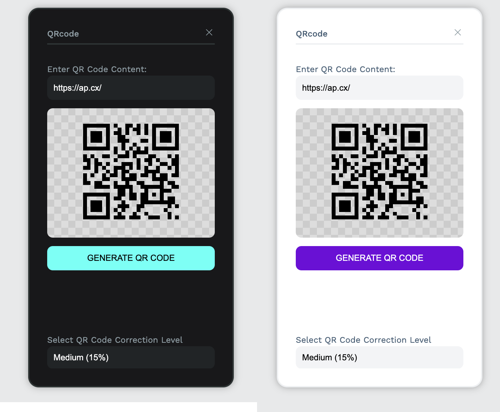
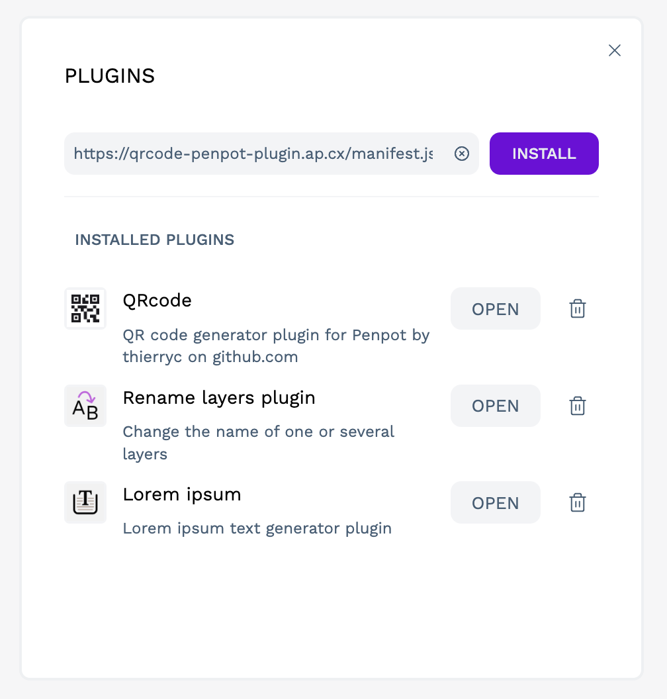

# QRcode Penpot Plugin

## Overview

The QRcode Penpot Plugin is a tool designed to generate QR codes directly within Penpot, a free and open-source design and prototyping platform. This plugin simplifies the process of creating and embedding QR codes in your design projects, enhancing interactivity and user engagement.





## Features

- **Seamless Integration**: Easily accessible from within the Penpot interface.
- **Customizable QR Codes**: Generate QR codes with customizable error correction levels.
- **Instant Preview**: View your QR code in real-time as you customize it.
- **Direct SVG Generation**: Generate the QR code as an SVG in your currently open Penpot file.

## Installation

1. Open Penpot and navigate to the plugin manager.
2. Click on "Plugin manager" (⌘⌥P) in the "Plugins" in the dot menu and enter the following URL:
   ```bash
   https://qrcode-penpot-plugin.ap.cx/manifest.json
   ```
3. Follow the prompts to complete the installation.





## Usage

1. **Access the Plugin**: Once installed, you can access the QRcode plugin from the plugins menu in Penpot.
2. **Generate QR Code**:
   - Open the plugin interface.
   - Enter the URL or text you want to encode in the QR code.
   - Customize the error correction level as needed.
3. **Preview and Insert**:
   - Preview the QR code to ensure it meets your requirements.
   - Insert the QR code as an SVG directly into your currently open Penpot file.

## Customization Options

- **Error Correction**: Choose the level of error correction (Low, Medium, High, Quartile) based on the intended use and the complexity of the QR code content. The default size of the QR code is set to 180x180 pixels, but since SVGs are vector-based, they can be resized to any size. Ensure the QR code is large enough to be scanned with a phone camera.

## Support

For issues, feature requests, or contributions, please visit our [GitHub repository](https://github.com/thierryc/qrcode-penpot-plugin) and open an issue to get support. Please remember to stay polite and courteous in your issues to ensure a positive and productive interaction.

## License

This plugin is released under the [MIT License](LICENSE).

## Open Source and Privacy

The QRcode Penpot Plugin is open-source, meaning its source code is freely available for anyone to view, modify, and distribute. This ensures transparency and allows the community to contribute to its improvement. Additionally, this plugin does not track or collect any personal data, ensuring your privacy and the security of your design projects.

## Follow Me

Stay updated with the latest news and updates about the QRcode Penpot Plugin by following me on [X (formerly Twitter)](https://x.com/Autre_planete).

---

Thank you for using the QRcode Penpot Plugin! We hope it enhances your design workflow and helps you create more interactive and engaging projects.

---
